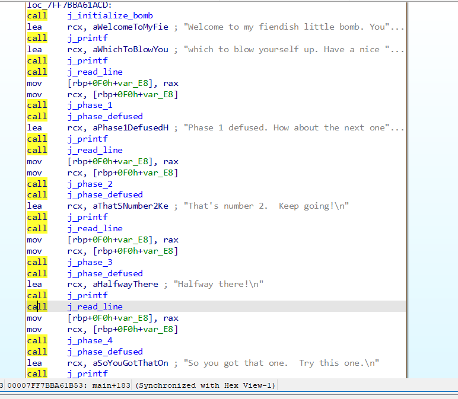
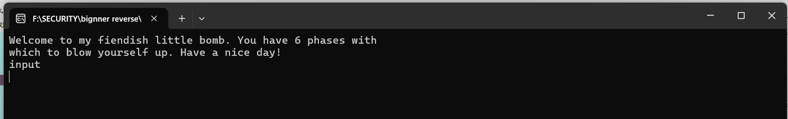
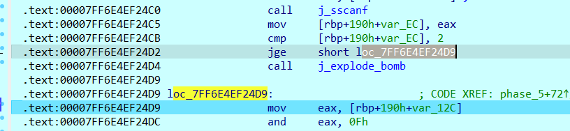

# Bomb Lab Write-up


In this lab, we have 6 phases and one secret phase they exist in the form of functions in the main function before every phase there is a call for a read line function that takes input from us and our goal is to get into every phase and defuse it by avoiding the explode bomb function 




> [!NOTE]
>you will see in every phase some initialization stuff that we will avoid like this :


the real challenge starts after 

now let’s start our lab

# phase 1


let’s start by putting a breakpoint on phase 1 and try any input to see what the function does



it seems that he puts a string (I am just a renegade hockey mom.) in the rdx register and then compares this string with the rcx register if the strings are not equal he won’t take the jump  and explode _bomb function will get called 


we can guess that the rcx register will have our input which will get compared with the rdx so let’s try this strange as input and see if we are right

we were right jump has been taken


and now we can say that phase1 defused and the answer is I am just a renegade hockey mom.


let’s now start with phase 2

# phase 2


as for phase 1 let’s start by putting a breakpoint on phase 2 and try any input to see what the function does


I found a function called read_six_numbers 


when we step into it we will find that this function calls a new function called j_sscanf it takes our input and then return with value. This value is compared with 6  the value should be greater than or equal to 6 if not  he won’t take the jump  and explode _bomb function will get called with our input the value that returned was 0 


when I searched about j_sscanf I found that j_sscanf is a function to determine how many integer numbers you entered It does this by counting the space between numbers

so now we are sure that your input should be 6 numbers at least  let’s try again with another input


as expected we passed the read_six_numbers function now it seems that our input gets stored in an int array and now he tries to access the first element (index 0) he will compare it with 1 if the first number equals 1 the jump will be taken otherwise we will get exploded luckily the first number I put is 1 so we will continue


after the jump, we will discover that we entered a loop that starts with i=1 and will end when it equals 6 (i is an imaginary variable)


in this loop, i start with 1 so it will start with the second number of the array let’s see what happens in the loop. First, it puts the i into rax and ecx registers then dec ecx register  by 1 so now we have rax which has the value 1 and rcx has the value 0 (we will treat them as index) now he tries to access the first element in the array (with rcx as index) and put the value at ecx register again then he multiplies the value by two `shl ecx, 1` the last thing he see if the first number *2 will equal the second number that he access (with rax as index ) If the condition is met he will complete the loop and i will be increased by 1 otherwise we will get exploded

so generally the loop checks if the first number *2 == the second number if the condition not met we will lose 


Adding together what we know about the input (6 numbers the first number is 1 and the first number*2 should equal the second number ) the input should be 1 2 4 8 16 32  let’s try

we were right Phase 2 defused 🥳


let’s now start with phase 3

# phase 3


as usual let’s start by putting breakpoint on phase 3 and try any input to see what the function does


```nasm
.text:00007FF6753221FB                 call    j_sscanf
.text:00007FF675322200                 mov     [rbp+150h+var_EC], eax
.text:00007FF675322203                 cmp     [rbp+150h+var_EC], 2
.text:00007FF675322207                 jge     short loc_7FF67532220E
.text:00007FF675322209                 call    j_explode_bomb
```

this time we exploded very fast I assumed that the input would be 6 numbers as the last phase but it seems to be only two numbers because it compares the output of the J_sscanf function with 2 it should be greater or equal to 2 so let’s try again with 3 4


after we passed the first condition that the output of j_sscanf is 2  IDA told us that we are dealing with a switch case that takes our first input as an argument and compares it with 7 if the number above 7 he will go to the default case (explode bomb function) our first number is 3 so we will continue let’s see what the switch do 

```nasm
.text:00007FF67532223A                 mov     eax, [rbp+150h+var_10C] ; jumptable 00007FF675322238 case 0
.text:00007FF67532223D                 add     eax, 274h
.text:00007FF675322242                 mov     [rbp+150h+var_10C], eax
.text:00007FF675322245
.text:00007FF675322245 loc_7FF675322245:                       ; CODE XREF: phase_3+A8↑j
.text:00007FF675322245                                         ; DATA XREF: phase_3:jpt_7FF675322238↓o
.text:00007FF675322245                 mov     eax, [rbp+150h+var_10C] ; jumptable 00007FF675322238 case 1
.text:00007FF675322248                 sub     eax, 24Ch
.text:00007FF67532224D                 mov     [rbp+150h+var_10C], eax
.text:00007FF675322250
.text:00007FF675322250 loc_7FF675322250:                       ; CODE XREF: phase_3+A8↑j
.text:00007FF675322250                                         ; DATA XREF: phase_3:jpt_7FF675322238↓o
.text:00007FF675322250                 mov     eax, [rbp+150h+var_10C] ; jumptable 00007FF675322238 case 2
.text:00007FF675322253                 add     eax, 2B0h
.text:00007FF675322258                 mov     [rbp+150h+var_10C], eax
.text:00007FF67532225B
.text:00007FF67532225B loc_7FF67532225B:                       ; CODE XREF: phase_3+A8↑j
.text:00007FF67532225B                                         ; DATA XREF: phase_3:jpt_7FF675322238↓o
.text:00007FF67532225B                 mov     eax, [rbp+150h+var_10C] ; jumptable 00007FF675322238 case 3
.text:00007FF67532225E                 sub     eax, 7Eh ; '~'
.text:00007FF675322261                 mov     [rbp+150h+var_10C], eax
.text:00007FF675322264
.text:00007FF675322264 loc_7FF675322264:                       ; CODE XREF: phase_3+A8↑j
.text:00007FF675322264                                         ; DATA XREF: phase_3:jpt_7FF675322238↓o
.text:00007FF675322264                 mov     eax, [rbp+150h+var_10C] ; jumptable 00007FF675322238 case 4
.text:00007FF675322267                 add     eax, 7Eh ; '~'
.text:00007FF67532226A                 mov     [rbp+150h+var_10C], eax
.text:00007FF67532226D
.text:00007FF67532226D loc_7FF67532226D:                       ; CODE XREF: phase_3+A8↑j
.text:00007FF67532226D                                         ; DATA XREF: phase_3:jpt_7FF675322238↓o
.text:00007FF67532226D                 mov     eax, [rbp+150h+var_10C] ; jumptable 00007FF675322238 case 5
.text:00007FF675322270                 sub     eax, 7Eh ; '~'
.text:00007FF675322273                 mov     [rbp+150h+var_10C], eax
.text:00007FF675322276
.text:00007FF675322276 loc_7FF675322276:                       ; CODE XREF: phase_3+A8↑j
.text:00007FF675322276                                         ; DATA XREF: phase_3:jpt_7FF675322238↓o
.text:00007FF675322276                 mov     eax, [rbp+150h+var_10C] ; jumptable 00007FF675322238 case 6
.text:00007FF675322279                 add     eax, 7Eh ; '~'
.text:00007FF67532227C                 mov     [rbp+150h+var_10C], eax
.text:00007FF67532227F
.text:00007FF67532227F loc_7FF67532227F:                       ; CODE XREF: phase_3+A8↑j
.text:00007FF67532227F                                         ; DATA XREF: phase_3:jpt_7FF675322238↓o
.text:00007FF67532227F                 mov     eax, [rbp+150h+var_10C] ; jumptable 00007FF675322238 case 7
.text:00007FF675322282                 sub     eax, 7Eh ; '~'
.text:00007FF675322285                 mov     [rbp+150h+var_10C], eax
.text:00007FF675322288                 jmp     short loc_7FF67532228F
```

it seems that he does some operations (add and sub)  on [rbp+150h+var_10C]  that he initializes with 0 before base on the first number you put and it doesn’t have break condition so it will complete to the end of the switch (to the jump at the end) now let’s see what he does with the value at [rbp+150h+var_10C]

```nasm
.text:00007FF67532228F                 cmp     [rbp+150h+var_14C], 5
.text:00007FF675322293                 jg      short loc_7FF67532229D
.text:00007FF675322295                 mov     eax, [rbp+150h+var_12C]
.text:00007FF675322298                 cmp     [rbp+150h+var_10C], eax
.text:00007FF67532229B                 jz      short loc_7FF6753222A2
.text:00007FF67532229D loc_7FF67532229D:                      
.text:00007FF67532229D                 call    j_explode_bomb
```

after the switch we have two condition  the first condition compares our first value with 5 it should be less than 5 or the program will call j_explode_bomb after the first condition  he moves our second value to eax register  `mov  eax, [rbp+150h+var_12C]`  and compare it with the value that we got from the operations that happen in the switch  it should be equal or you know what will happen 🙃

so my first value was 3 when we start from case 3 to the end in the switch the result of operations   

will be 0xFFFFFF82 after converting to decimal it will be -126 so our input will be 3 -126


and now congratulation phase 3 defused let’s complete our journey with phase 4

# phase 4


let’s start by putting breakpoint on phase 4 and try any input to see what the function does

I assumed that the input would be two numbers as phase 3 


```nasm
.text:00007FF6753223AD                 call    j_sscanf
.text:00007FF6753223B2                 mov     [rbp+170h+var_EC], eax
.text:00007FF6753223B8                 cmp     [rbp+170h+var_EC], 2
.text:00007FF6753223BF                 jnz     short loc_7FF6753223CD
```

my assumption was right he compares the output of j_sscanf with 2 it should equal 2 so we can continue after this condition we have another two conditions


first, the program sees if our first value ( 3 ) stored in [rbp+170h+var_16C] is less than 0 if the condition is met we will explode as usual so our first number should be positive then he compares [rbp+170h+var_16C]  with 0Eh (14 in decimal ) it should be less than or equal 14 so we can continue 

```nasm
.text:00007FF6753223D2                 mov     [rbp+170h+var_10C], 0Ah
.text:00007FF6753223D9                 mov     r8d, 0Eh
.text:00007FF6753223DF                 xor     edx, edx
.text:00007FF6753223E1                 mov     ecx, [rbp+170h+var_16C]
.text:00007FF6753223E4                 call    j_func4
```

after the jump he starts to do some initialization  then he calls j_func4 that does some operations based on the first number we put (to be honest I didn't understand what it does) 


after the call the output of j_func4 was 0xA (10 in decimal ) he moves it to [rbp+170h+var_12C]       `mov [rbp+170h+var_12C], eax` then he compares the output of the function with  [rbp+170h+var_10C] that he initializes with A before. They should be equal or we will explode(luckily my first try generated 0xA from the function) after we continue we will see that he compares our second number with  [rbp+170h+var_10C] it should be equal so now we know that our first number should be 3 and the second should be 10 so let’s try 3 10


Now somehow we can say that phase 4 defused let’s see phase5

# phase 5


as usual let’s start by putting breakpoint on phase 5 and try any input to see what the function does

In this phase, I also assumed that the input would be two numbers as phase 4,3




my assumption was right he compares the output of j_sscanf with 2 it should equal 2 so we can continue 

So, now we see some logic. First, moving the first input to eax doing AND operation with 0Fh (15 in decimal) and then moving the result again to first input location

After that, he makes some initialization: putting our first number in [rbp+190h+var_14C] and initializing [rbp+190h+var_18C] and [rbp+190h+var_16C] with 0


after the initialization. We can figure out from the structure that there is looping on an array. In this loop first, he compares [rbp+190h+var_12C]  (which has our first number with) 0Fh (15 in decimal)  if equal, he will jump some were but in our case the condition not met so we will continue. we will notice also  that [rbp+190h+var_18C] is considered the counter for this loop (we can guess from the initialize with 0 and every time he only increases it by 1) after that it seems that he takes elements from an array based on rax and rcx registers  and put it in [rbp+190h+var_12C] then he sums this element with  [rbp+190h+var_16C] (that he initializes with 0 before) and put the answer in  [rbp+190h+var_16C] again 

so generally the loop sums the elements of the array until it reaches the element 0Fh and considers [rbp+190h+var_18C]  as a counter


after the loop, we will see that we have two conditions the first one compares [rbp+190h+var_18C] with 0Fh, if not equal he will call j_explode_bomb so we should loop 10 times or we will explode the second condition compares the sum of the array ([rbp+190h+var_16C]) with the second number it should be equal so we can continue or we will explode


to be honest I didn’t find a way instead of trying numbers from 0 to 14 (because we make AND operation with 0Fh so our input will be always 1 number in hex ) as a first number until we met the condition luckily my first try was 5 and this the number that met the condition we will only make the second number equal the sum of the array 

by looking in the rcx register we will find that the sum of the array after the loop equals 73 (115 in decimal)


so the answer will be 5 115 


and now phase 5 defused and we have only one phase left (that I didn’t know how to pass yet🙂)

